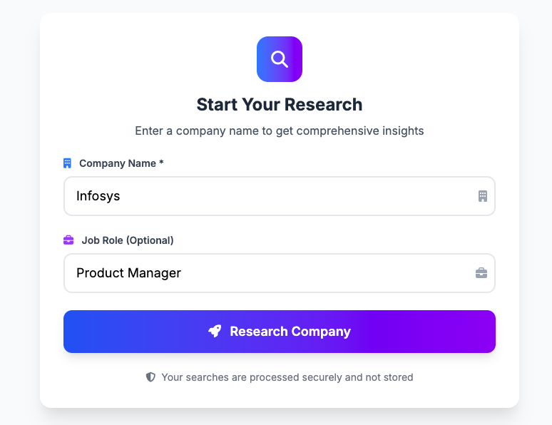
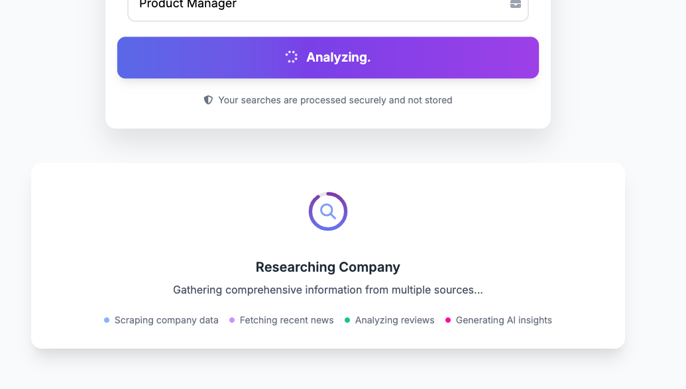
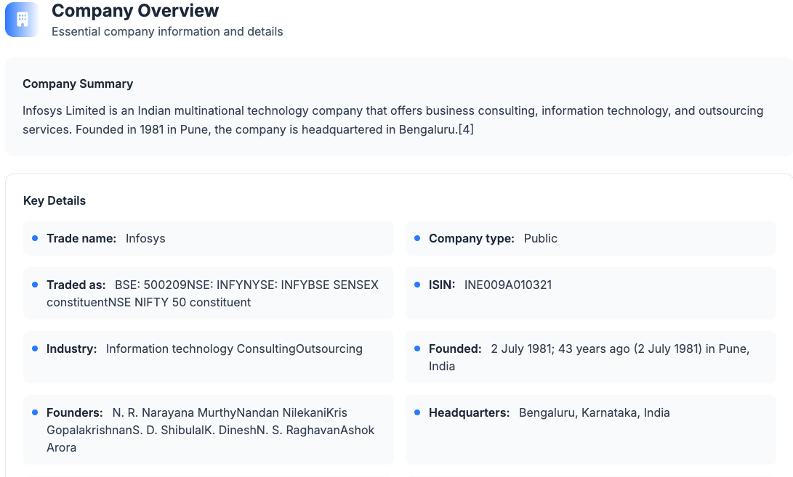
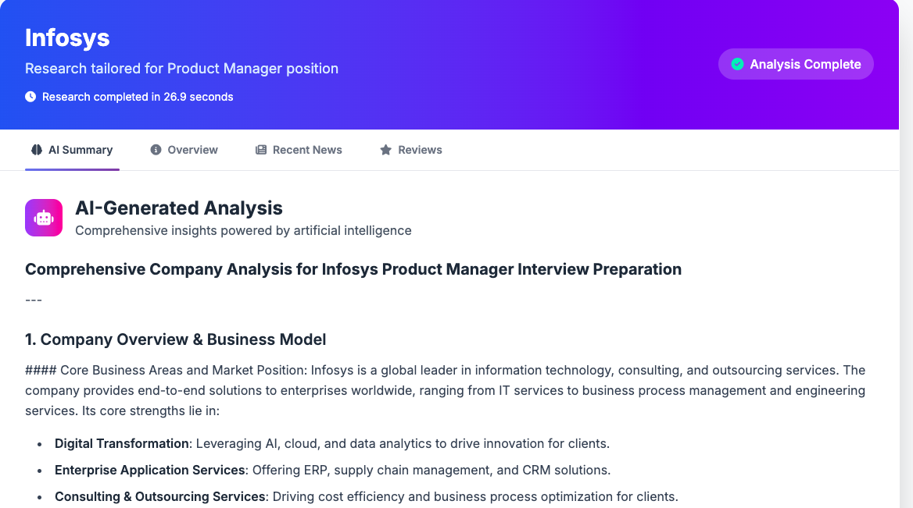

# KnowBeforeGo.ai 🚀

> AI-Powered Company Research Assistant for Interview Preparation






## 📋 Table of Contents

- [Overview](#overview)
- [Features](#features)
- [Tech Stack](#tech-stack)
- [Installation](#installation)
- [Configuration](#configuration)
- [Usage](#usage)
- [API Endpoints](#api-endpoints)
- [Project Structure](#project-structure)
- [Contributing](#contributing)
- [License](#license)

## 🎯 Overview

KnowBeforeGo.ai is an intelligent company research platform that helps job seekers prepare for interviews by providing comprehensive company insights. The application leverages AI to analyze company data from multiple sources and generates tailored summaries for interview preparation.

### Key Capabilities

- **Company Intelligence**: Scrapes Wikipedia and other sources for company information
- **News Analysis**: Fetches recent company news and developments
- **Employee Insights**: Provides employee reviews and workplace culture analysis
- **AI-Powered Summaries**: Generates personalized interview preparation insights
- **Role-Specific Research**: Tailors research based on specific job roles

## ✨ Features

### 🔍 **Multi-Source Data Gathering**
- Wikipedia data mining with fallback mechanisms
- Real-time news aggregation
- Employee review analysis
- Company financial and operational insights

### 🤖 **AI-Powered Analysis**
- GitHub Models integration with GPT-4
- Context-aware company summaries
- Interview preparation strategies
- Role-specific insights and recommendations

### 🎨 **Modern Web Interface**
- Responsive design with Tailwind CSS
- Interactive tabs and smooth animations
- Glass morphism effects and modern UI
- Print-friendly report generation

### ⚡ **Performance Optimized**
- Async/await architecture
- Intelligent caching system
- Concurrent data fetching
- Progressive loading indicators

## 🛠 Tech Stack

### Backend
- **Framework**: FastAPI
- **Language**: Python 3.8+
- **AI Integration**: OpenAI API via GitHub Models
- **Web Scraping**: BeautifulSoup, aiohttp
- **Async Operations**: asyncio

### Frontend
- **Styling**: Tailwind CSS
- **Icons**: Font Awesome
- **Fonts**: Google Fonts (Inter)
- **Animations**: Custom CSS animations

### External APIs
- **News**: NewsData.io API
- **AI**: GitHub Models (GPT-4)
- **Data Sources**: Wikipedia, various news sources

## 📦 Installation

### Prerequisites
- Python 3.8 or higher
- Git
- API keys for external services

### Step-by-Step Setup

1. **Clone the Repository**
```bash
git clone https://github.com/yourusername/KnowBeforeGo.ai.git
cd knowbeforego-ai
```

2. **Create Virtual Environment**
```bash
python -m venv venv
source venv/bin/activate  # On Windows: venv\Scripts\activate
```

3. **Install Dependencies**
```bash
pip install -r requirements.txt
```

4. **Create Required Directories**
```bash
mkdir templates static static/css static/js
```

5. **Set Up Files**
   - Copy `index.html` to `templates/`
   - Copy `script.js` to `static/js/`
   - Copy `styles.css` to `static/css/`

## ⚙️ Configuration

### Environment Variables

Create a `.env` file in the root directory:

```env
# GitHub Token for AI Models
GITHUB_TOKEN=your_github_token_here

# NewsData.io API Key
NEWS_API_KEY=your_newsdata_io_api_key_here

# Optional: Custom settings
CACHE_EXPIRY=3600
MAX_CACHE_SIZE=100
```

### API Keys Setup

#### 1. GitHub Token (Required)
- Go to [GitHub Settings > Developer settings > Personal access tokens](https://github.com/settings/tokens)
- Generate a new token with appropriate permissions
- Add to `.env` file as `GITHUB_TOKEN`

#### 2. NewsData.io API Key (Recommended)
- Sign up at [NewsData.io](https://newsdata.io/)
- Get your API key from the dashboard
- Add to `.env` file as `NEWS_API_KEY`

> **Note**: Without the News API key, the application will use mock news data

## 🚀 Usage

### Development Server

```bash
python main.py
```

The application will be available at `http://localhost:8000`

### Production Deployment

```bash
uvicorn main:app --host 0.0.0.0 --port 8000
```

### Using the Application

1. **Enter Company Name**: Type the company you're researching
2. **Optional Job Role**: Specify the position for tailored insights
3. **Click Research**: Wait for AI analysis to complete
4. **Review Results**: Explore tabs for different insights:
   - **AI Summary**: Comprehensive analysis and interview tips
   - **Overview**: Company details and background
   - **Recent News**: Latest developments and announcements
   - **Reviews**: Employee feedback and workplace insights

## 📚 API Endpoints

### `POST /research`
Research a company and generate comprehensive insights.

**Request Body:**
```json
{
  "company_name": "Google",
  "job_role": "Software Engineer"
}
```

**Response:**
```json
{
  "company_name": "Google",
  "job_role": "Software Engineer",
  "company_info": {
    "summary": "Company overview...",
    "details": {...},
    "status": "success"
  },
  "news": {
    "status": "success",
    "articles": [...]
  },
  "reviews": [...],
  "ai_summary": "Comprehensive AI analysis...",
  "processing_time": 3.45,
  "status": "success"
}
```

### `GET /health`
Check application health status.

**Response:**
```json
{
  "status": "healthy",
  "timestamp": 1640995200.0
}
```

## 📁 Project Structure

```
knowbeforego-ai/
├── main.py              # FastAPI application
├── requirements.txt     # Python dependencies
├── .env                # Environment variables
├── .gitignore          # Git ignore rules
├── README.md           # Project documentation
├── templates/
│   └── index.html      # Main HTML template
├── static/
│   ├── css/
│   │   └── styles.css  # Enhanced stylesheets
│   └── js/
│       └── script.js   # Frontend JavaScript
└── __pycache__/        # Python cache (auto-generated)
```

## 🔧 Configuration Options

### Cache Settings
- `CACHE_EXPIRY`: Cache duration in seconds (default: 3600)
- `MAX_CACHE_SIZE`: Maximum cache entries (default: 100)

### API Timeouts
- Wikipedia scraping: 15 seconds
- News API: 10 seconds
- AI generation: 30 seconds

### Customization
- Modify `normalize_company_name()` for better company name matching
- Adjust `get_mock_news_async()` for custom fallback news
- Update CSS variables for theme customization

## 🤝 Contributing

We welcome contributions! Please follow these steps:

1. **Fork the Repository**
2. **Create Feature Branch**
   ```bash
   git checkout -b feature/amazing-feature
   ```
3. **Commit Changes**
   ```bash
   git commit -m 'Add amazing feature'
   ```
4. **Push to Branch**
   ```bash
   git push origin feature/amazing-feature
   ```
5. **Open Pull Request**

### Development Guidelines
- Follow PEP 8 for Python code
- Add docstrings for new functions
- Test thoroughly before submitting
- Update documentation as needed

## 🐛 Troubleshooting

### Common Issues

**1. API Key Errors**
- Ensure `.env` file exists and contains valid keys
- Check API key permissions and quotas

**2. Slow Response Times**
- Verify internet connection
- Check if external APIs are responsive
- Consider increasing timeout values

**3. Missing Data**
- Some companies may have limited Wikipedia presence
- News API may have rate limits
- Fallback data will be used when primary sources fail

**4. Import Errors**
- Ensure all dependencies are installed: `pip install -r requirements.txt`
- Activate virtual environment before running

## 📄 License

This project is licensed under the MIT License - see the [LICENSE](LICENSE) file for details.

## 🙏 Acknowledgments

- **FastAPI** for the excellent web framework
- **OpenAI** for AI capabilities via GitHub Models
- **NewsData.io** for news aggregation services
- **Tailwind CSS** for modern styling
- **Font Awesome** for beautiful icons

## 📞 Support

For support, questions, or feature requests:
- Open an issue on GitHub
- Contact: [devyanshvakharia2510@gmail.com]
- Documentation: [Project Wiki](https://github.com/Devyansh-Vakharia/KnowBeforeGo.ai/wiki)

---

<div align="center">

**Built with ❤️ for job seekers worldwide**

[⭐ Star this repo](https://github.com/Devyansh-Vakharia/KnowBeforeGo.ai) if you find it helpful!

</div>
